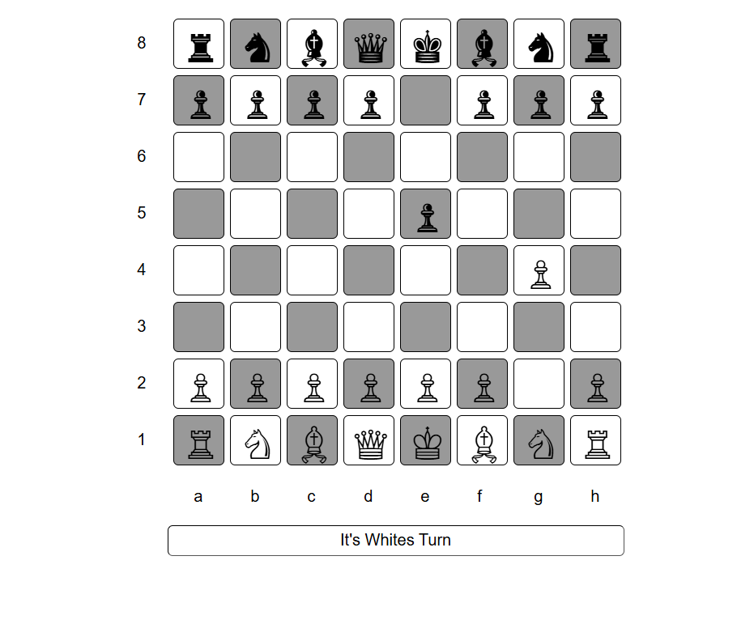

# JavaScript Chess Game

A beginner-friendly chess game built with HTML, CSS, and vanilla JavaScript. It runs directly in the browser and is designed to demonstrate core frontend skills such as DOM manipulation, turn-based logic, and interactive user experience.

## Screenshot

  

## Features

- Chess board UI
- Piece movement logic
- Turn-based gameplay
- Interactive JavaScript DOM handling

## Tech Stack

- HTML
- CSS
- JavaScript (Vanilla JS)

## How to Run

1. Clone the repository.
2. Open the `source code` folder.
3. Open `index.html` in your browser.

If you prefer, you can also use a local development server, but it is not required because the project runs in the browser.

## Project Purpose

This project was built to practice JavaScript logic, DOM manipulation, and the fundamentals of game development in a simple browser-based application.

## Future Improvements

- Check and checkmate detection
- AI opponent
- Move highlighting
- Better UI and animations

## Author

Bibek Chand